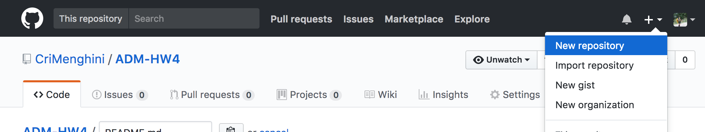
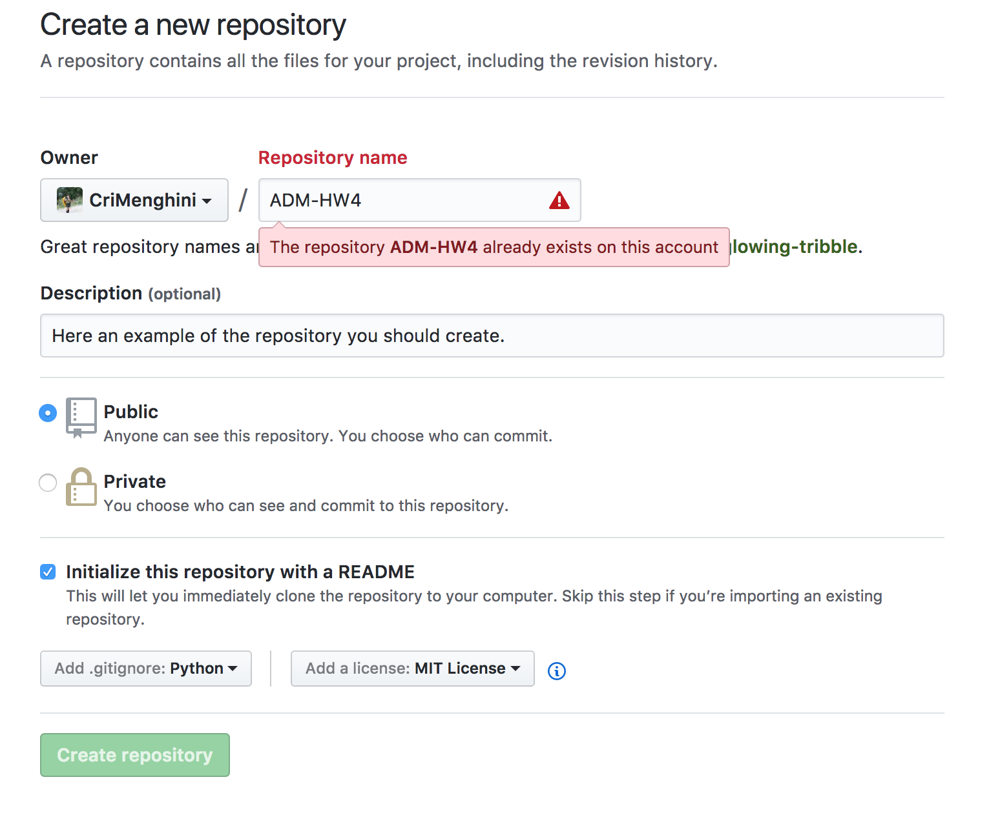
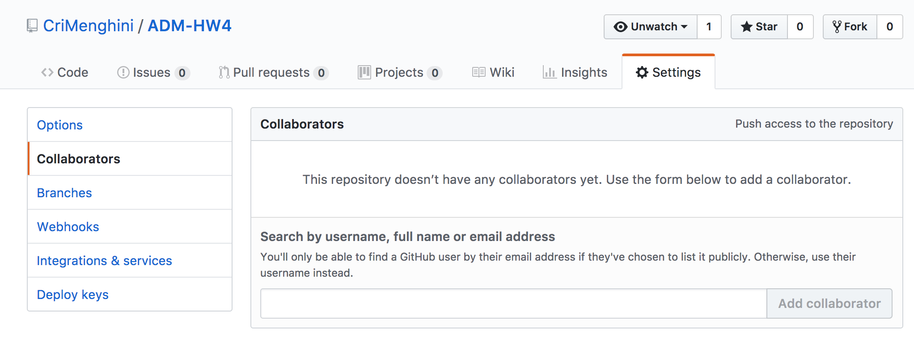

# ADM-HW4
## How to create the repository

1) Go to your GitHub profile, of one of the team member, on the Web. And click on the plus.

2) Fill in the form

* Be sure that you choose a name that isn't already in the list of your repository
* Allow the public to see your folder
* Choose to initialize the folder with a README file. The README is provided in `.md` format. Here a smart and useful [cheatsheet](https://github.com/adam-p/markdown-here/wiki/Markdown-Cheatsheet) to learn easily how it works. 

> (To those who already practised with RStudio is exatcly the same language you use compiling MarkDown.)

* Tell the repository to ignore (when you'll make commits) the `python checkpoint files`.
* Add a license to define the rules the others can use the code you produced.

3) Once the repository is created, immediately add the collaborators (the member of the group).

> Now all the member of the group should be able to modify the repository. The contribution of each member are visible.

4) Now each memeber of the team should clone the repository on his laptop.

* Open the terminal and do 

`git clone <URL_of_the_repository>`

Since now one you can work on your laptop
__IT IS VERY IMPORTANT__ that before starting to work in the folder you place in it and do 
	`git pull`: it allowes you to work on updated files. __Be careful:__ you need to coordinate with you colleagues otherwise you would overwrite the work.

When you want to commit the work on the web you should:

	1) Place in the git folder
	2) git add .
	3) git commit -m "[ADD] I add the code related to the graph"
	4) git push origin master
	
Then you can find the updates on the web.

# Requirements
To do the operations from the terminal you need to [download git](https://git-scm.com/downloads).

